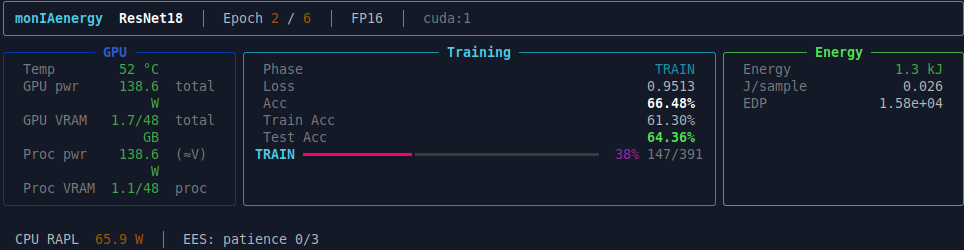
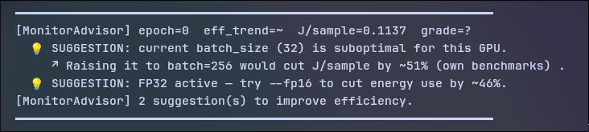
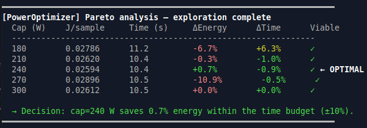
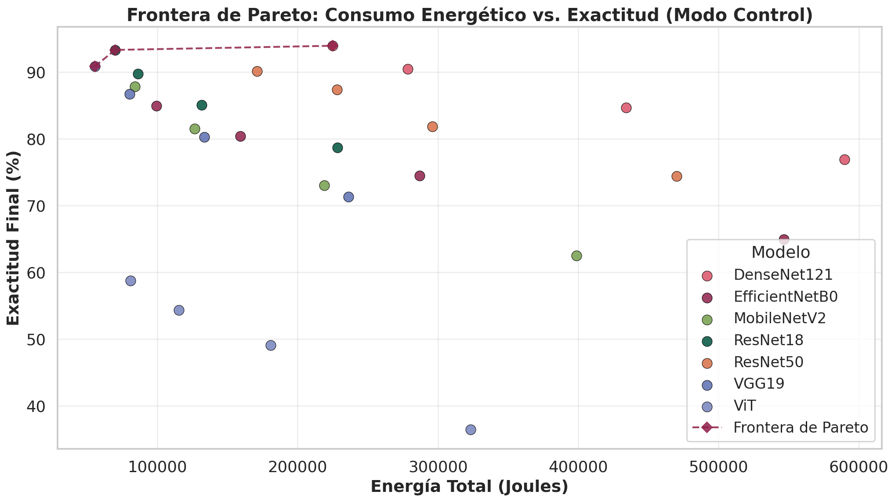
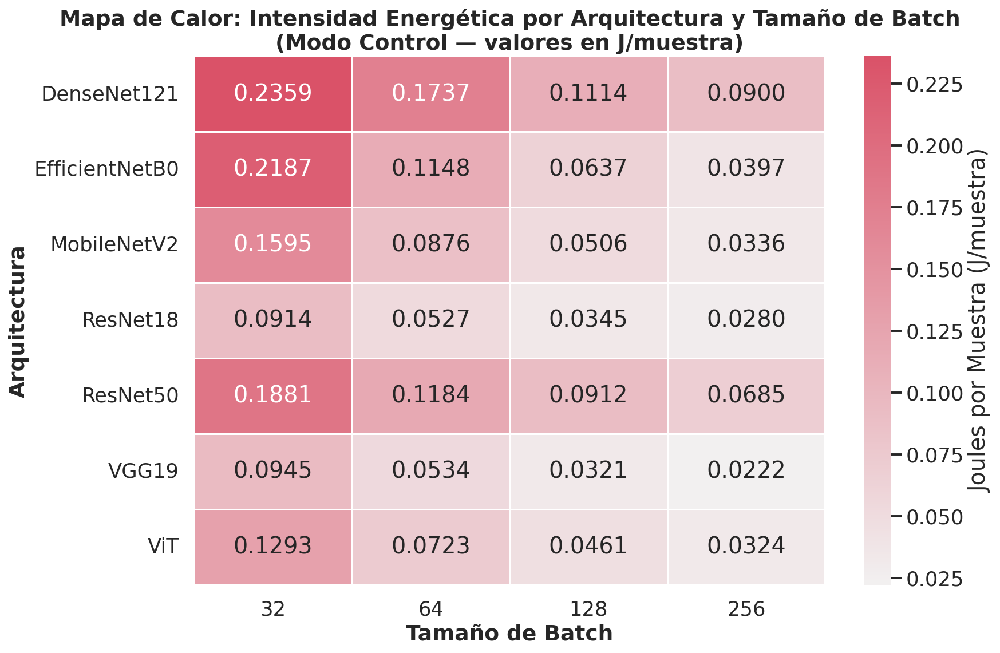
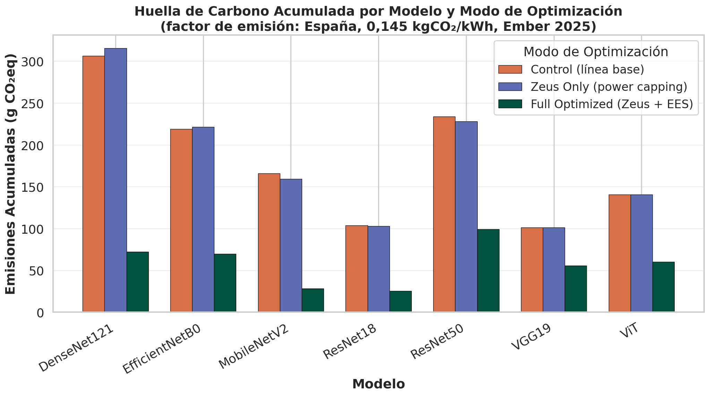

# monIAenergy ⚡

**Medición real de energía y huella de carbono para entrenamiento de modelos en Python y PyTorch.**

[](LICENSE)
[](https://www.python.org/)
[](tests/)
[](pyproject.toml)

La mayoría de las herramientas de seguimiento energético en aprendizaje automático **estiman**
el consumo a partir de fichas técnicas, con una incertidumbre declarada del 15–30 %. Ese margen
suele ser mayor que el ahorro que se pretende atribuir a una optimización, lo que invalida la
comparación.

`moniaenergy` **mide**: lee los contadores de potencia integrados en el propio silicio —Intel RAPL
para CPU y NVIDIA NVML para GPU— con una precisión de ±5 %, desagrega el consumo por época, por
capa y por muestra, y actúa sobre el hardware para reducirlo.

| | Estimación paramétrica | `moniaenergy` |
|:---|:---|:---|
| Mecanismo | Ficha técnica × utilización | Contadores de hardware |
| Incertidumbre | ±15–30 % | ±5 % |
| Granularidad | Experimento o época | Época, capa y muestra |
| Actuación | Ninguna | Límite de potencia y parada por eficiencia |

---

## Índice

- [Instalación](#instalación) · [Uso](#uso) · [Métricas](#métricas-recogidas)
- [Green AI Grade](#green-ai-grade) · [Optimización activa](#optimización-activa)
- [Resultados sobre 420 ejecuciones](#resultados-sobre-420-ejecuciones)
- [Reproducibilidad](#reproducibilidad) · [Requisitos](#requisitos)

---

## Vista previa

Panel de telemetría en vivo durante el entrenamiento: salud del hardware, progreso del modelo y
coste energético acumulado, actualizados al cierre de cada época.



El asesor de optimización analiza la tendencia de eficiencia y emite sugerencias accionables
cuando detecta un margen de mejora superior al 10 %.



El optimizador de potencia expone la tabla de candidatos evaluados y el criterio de selección,
de modo que la decisión de recortar vatios es auditable y no una caja negra.



---
## Instalación

Requiere Python 3.11 o superior sobre Linux. La dependencia de Linux viene del acceso a los
contadores RAPL a través de `/sys/class/powercap/`.

```bash
git clone https://github.com/BenjyInsights/monIAenergy.git
cd monIAenergy

pip install -e .              # base: medición de CPU
pip install -e ".[gpu]"       # añade pynvml y soporte de GPU NVIDIA
pip install -e ".[dev]"       # pytest, ruff, black, mypy
```

### Niveles de privilegio

El framework distingue tres niveles, y solo el primero funciona sin preparación previa:

| Capacidad | Privilegios | Comportamiento sin ellos |
|:---|:---|:---|
| Lectura de GPU (NVML) | Usuario ordinario | — |
| Lectura de CPU (RAPL) | Administrador | CPU marcada como no disponible; la GPU se sigue midiendo |
| Fijar límite de potencia | Administrador | El optimizador pasa a modo solo-sugerencias |

Los contadores RAPL están restringidos a `root` desde Linux 5.10, como mitigación de
CVE-2020-8694. Para habilitar la medida de CPU sin ejecutar todo como administrador:

```bash
sudo chmod a+r /sys/class/powercap/intel-rapl/intel-rapl:0/energy_uj
```

---

## Uso

### Integración en una línea

`monitor_train` activa la pila completa: muestreo de hardware, seguimiento de épocas,
calificación energética y asesor de optimización.

```python
from monIAenergy import monitor_train

with monitor_train(
    model,                   # torch.nn.Module (autodetecta el nº de parámetros)
    "mi_experimento",        # nombre del run; define la ruta del log
    country="Spain",         # factor de emisión aplicado
    batch_size=128,
    fp16=False,
    early_stopping=True,     # parada por eficiencia energética
    patience=3,
    power_optimize=True,     # optimizador de potencia de GPU
    gpu_index=0,
    time_budget_pct=0.10,    # sobrecoste temporal admisible
) as mon:
    for epoch in range(num_epochs):
        mon.epoch_start(epoch)
        loss, acc = train_one_epoch(loader, model, optimizer)
        if mon.epoch_end(epoch, samples=len(dataset), loss=loss, accuracy=acc):
            break            # la parada por eficiencia ha decidido detenerse
```

Al cerrar el contexto se emite el informe final:

```text
══════════════════════════════════════════════════════════════════
  monitor_train — Final Report: mi_experimento
══════════════════════════════════════════════════════════════════
  Energy Grade:             A+  (420.1% of ref)
  J/sample (mean):          0.0352
  Total energy (mean/ep):   1.76 kJ
  CO₂ estimated (Spain   ): 0.07 g
  Log saved to:             logs/mi_experimento/run_20260331_083000.ndjson
══════════════════════════════════════════════════════════════════
```

### API por componentes

Cuando se necesita control directo sobre cada pieza:

```python
from moniaenergy import (
    MonitorContext, EpochTracker, EnergyEarlyStopping,
    LayerEnergyProfiler, compute_energy_metrics,
)

profiler = LayerEnergyProfiler(model, device="cuda")

with MonitorContext(
    context="ResNet18_CIFAR10",
    interval=1.0,
    log_file_path="logs/run_001",
) as mon:
    tracker = EpochTracker(mon.monitor.log_file_path)
    ees = EnergyEarlyStopping(
        log_file_path=mon.monitor.log_file_path,
        min_efficiency_ratio=0.05,
        patience=3,
    )

    for epoch in range(50):
        tracker.on_epoch_start(epoch)
        loss, acc = train_one_epoch(...)
        tracker.on_epoch_end(epoch, samples=50000, loss=loss, accuracy=acc)
        if ees.step(epoch=epoch, accuracy=acc):
            break

energy_df = compute_energy_metrics("logs/run_001.ndjson")
```

### Decorador de función

Para medir una función concreta sin envolver un bucle completo:

```python
from moniaenergy import inline_monitor

@inline_monitor(context="Inferencia", interval=1, log_file_path="logs/infer")
def run_inference(model, data):
    return model(data)
```

---
## Métricas recogidas

| Componente | Métrica | Descripción |
|:---|:---|:---|
| GPU | `Power Usage (W)` | Consumo del chip a nivel de placa (NVML) |
| GPU | `Process Power Usage (W)` | Fracción del proceso: `(placa − reposo) × ratio SM` |
| GPU | `VRAM (MB/GB)` | Memoria total y del proceso |
| GPU | `Temperature (ºC)`, `Fan (%)` | Salud térmica |
| GPU | `Carbon Emissions (g CO₂)` | Por país y continente |
| CPU | `RAPL Package Power (W)` | Consumo del paquete (Intel RAPL) |
| CPU | `Process Package Power (W)` | Cuota atribuida al proceso |
| CPU | `Core Usage (%)`, `Frequency (MHz)` | Por núcleo |
| RAM | `Process Memory Usage (MB)` | Memoria residente del proceso |
| Época | `total_energy_j` | Energía de GPU y CPU integrada sobre la época |
| Época | `energy_per_sample_j` | Julios por muestra procesada |
| Época | `edp` | Energy-Delay Product (J × s) |
| Época | `energy_grade` | Calificación A++ … F |
| Época | `co2_<pais>_g` | Emisiones estimadas por país |

---

## Green AI Grade 🌱

Una cifra en julios no dice por sí sola si una configuración es eficiente: falta una referencia
con la que compararla. La calificación traduce el consumo medido a un juicio accionable, con una
fórmula independiente del dataset y del hardware.

```
eff_score = (accuracy × log10(parameters)) / total_energy_j
grade     = eff_score comparado con una referencia autocalibrada
```

| Grado | Porcentaje de la referencia | Ejemplo observado en CIFAR-10 |
|:---:|:---|:---|
| **A++** | ≥ 800 % | VGG19 FP16, batch 256 |
| **A+** | ≥ 400 % | ResNet18 FP16, batch 256 |
| **A** | ≥ 200 % | ResNet18 FP32, batch 128 |
| **B** | ≥ 100 % | MobileNetV2 batch 128 |
| **C** | ≥ 50 % | MobileNetV2 batch 32 |
| **D** | ≥ 20 % | DenseNet121 batch 32 |
| **E** | ≥ 5 % | Entrenamiento en CPU |
| **F** | < 5 % | CPU con modelo grande |

La referencia parte de un valor por defecto (`1e-4`) y, en cuanto hay historial,
`calibrate_reference(scores)` la fija en la mediana de las ejecuciones propias. La calificación
es por tanto **relativa al conjunto evaluado**, no una certificación trasladable entre
plataformas.

---

## Optimización activa 🎯

### Optimizador de potencia de GPU

El consumo no crece linealmente con el límite de potencia: recortarlo suele ahorrar energía con
una penalización temporal pequeña. `GpuPowerOptimizer` localiza ese punto en **una sola
ejecución**, en tres fases:

1. **Exploración.** Prueba una época por cada límite candidato, entre el 60 % y el 100 % de la
   capacidad nominal de la tarjeta.
2. **Evaluación.** Construye la frontera de Pareto en el plano energía–tiempo y descarta los
   candidatos que exceden el presupuesto temporal `time_budget_pct`.
3. **Explotación.** Fija el límite seleccionado durante el resto del entrenamiento.

La tabla de candidatos se imprime íntegra, con el criterio de viabilidad y el punto elegido
señalado, de modo que la decisión queda documentada (véase la captura de la vista previa).

**Degradación y seguridad.** Modificar el límite de potencia exige privilegios de administrador.
Sin ellos el módulo no aborta: imprime el mismo análisis marcándolo como recomendación. Ante
`SIGINT` o `SIGTERM` restaura siempre el límite original antes de salir.

### Parada temprana por eficiencia energética

`EnergyEarlyStopping` detiene el entrenamiento cuando la ganancia de exactitud por julio
invertido cae por debajo de un umbral autocalibrado sobre la primera época productiva:

```
umbral = min_efficiency_ratio × eficiencia_primera_época
```

El valor por defecto es `0.05`. La autocalibración hace el criterio agnóstico al hardware y al
dataset. La paciencia (`patience`, por defecto 3) evita que el ruido de SGD dispare una parada
falsa: con una probabilidad de época improductiva del 10 %, tres épocas consecutivas sitúan el
falso positivo en el orden de 10⁻³.

### Asesor de optimización

Analiza el historial de épocas y emite sugerencias cuando detecta un margen superior al 10 %:
tamaño de lote infrautilizado para la GPU, precisión simple donde la mixta ahorraría, o
tendencia de eficiencia decreciente. Cada tipo de sugerencia se emite **una sola vez por
sesión** y fuera del panel principal, sin interrumpir el entrenamiento.

### Comparación con Zeus

[Zeus](https://ml.energy/zeus) (ML.Energy Initiative, University of Michigan) es el referente en
optimización activa de potencia. `moniaenergy` adopta su actuador —NVML— pero no su política:

| Aspecto | `moniaenergy` | Zeus |
|:---|:---|:---|
| Algoritmo | Barrido explícito con selección de Pareto | Bandidos multibrazo (ε-greedy) |
| Convergencia | Una sola ejecución | Varias ejecuciones del mismo trabajo |
| Justificación | Tabla de candidatos y criterio expuestos | Métricas crudas |
| Desagregación por capa | Sí (`LayerEnergyProfiler`) | No |
| Calificación energética | Escala A++ a F | No |
| Parada por eficiencia | Sí | No |
| Sin privilegios | Degrada a solo-sugerencias | Error fatal |
| Restauración ante señales | `SIGINT` y `SIGTERM` gestionados | Sí |

---

## Salida de datos

Cada ejecución genera:

| Fichero | Contenido |
|:---|:---|
| `logs/<run>/<ts>.ndjson` | Traza de muestreo de hardware |
| `logs/<run>/<ts>.events.ndjson` | Eventos de época |
| `logs/<run>/<ts>_energy_metrics.csv` | Métricas agregadas por época, con `energy_grade` |
| `logs/<run>/<ts>_layer_profile.csv` | Tiempo de cómputo por capa |
| `plots/<run>/` | Gráficas generadas |

El formato NDJSON —un objeto JSON por línea— permite procesar trazas largas de forma incremental
y es directamente legible con las herramientas habituales de análisis.

Las tablas y figuras derivadas se generan con la cadena de análisis descrita en
[Reproducibilidad](#reproducibilidad).

---

## Factores de emisión

`data/2025_Country_Carbon_Emissions.csv` recoge 17 regiones (fuente: Ember 2025). Cuando el país
solicitado no figura, se aplica automáticamente la media mundial.

| Región | gCO₂/kWh | Región | gCO₂/kWh |
|:---|---:|:---|---:|
| Francia | 65 | Brasil | 103 |
| España | 145 | Reino Unido | 185 |
| Alemania | 380 | Estados Unidos | 384 |
| Corea del Sur | 425 | Australia | 480 |
| Japón | 485 | China | 560 |
| India | 708 | Media mundial | 473 |

---
## Resultados sobre 420 ejecuciones 📊

El framework se validó con una matriz factorial completa. Todas las cifras se generan con
`tools/generate_benchmark_analysis.py` a partir de `benchmark_master_dataset.json` y se vuelcan
en `results/csv/` y `results/figuras/`.

| Variable | Valor |
|:---|:---|
| Dataset | CIFAR-10 (50.000 entrenamiento / 10.000 validación) |
| Modelos | VGG19, ResNet18, ResNet50, DenseNet121, MobileNetV2, EfficientNetB0, ViT |
| Tamaños de lote | 32, 64, 128, 256 |
| Modos | `Control`, `Zeus_Only` (límite de potencia), `Full_Optimized` (límite + parada por eficiencia) |
| Repeticiones | 5 por configuración → **420 ejecuciones** (7 × 4 × 3 × 5) |
| Épocas | 50 fijas; `Full_Optimized` puede detenerse antes |
| Hardware | NVIDIA RTX 6000 Ada 48 GB (NVML) + Intel Xeon (RAPL) |
| Software | PyTorch 2.6, CUDA 12.6, precisión mixta |
| Coste medido | **73,6 MJ** y **2,95 kg CO₂** con el mix eléctrico español |

Estadísticos globales: 0,0907 ± 0,0612 J/muestra (IC 95 %: 0,0848–0,0966), 75,92 % de exactitud
media y 7,02 g CO₂ por ejecución.

### El consumo no se deduce del tamaño del modelo

Media sobre las 20 ejecuciones de cada arquitectura:

| Modelo | J/muestra | CO₂ total (g) | Exactitud máx. | Grado modal |
|:---|---:|---:|---:|:---:|
| VGG19 | 0,0506 | 101,4 | 91,17 % | B |
| ResNet18 | 0,0516 | 103,6 | 93,51 % | B |
| ViT | 0,0700 | 140,4 | 60,63 % | C |
| MobileNetV2 | 0,0828 | 166,0 | 88,14 % | C |
| EfficientNetB0 | 0,1092 | 218,9 | 85,50 % | D |
| ResNet50 | 0,1166 | 233,9 | 90,75 % | D |
| DenseNet121 | 0,1527 | 306,3 | 94,04 % | D |

Hay un factor **3×** entre el modelo más y el menos eficiente resolviendo el mismo problema, y el
recuento de parámetros no lo predice: MobileNetV2 (3,5 M) gasta un 60 % más por muestra que VGG19
(143 M). Sus convoluciones separables tienen baja intensidad aritmética, de modo que la GPU pasa
más tiempo esperando datos que calculando.





### La parada por eficiencia es la palanca de mayor impacto

Ahorra en **las 28 configuraciones evaluadas**, sin excepción.

| Métrica | Valor |
|:---|:---|
| Ahorro energético medio | **63,46 %** (rango 14,93 % – 83,84 %) |
| Épocas ejecutadas | 18,2 de media frente a 50 |
| Coste en exactitud | 4,00 puntos porcentuales |
| Significancia (Mann-Whitney U) | p < 0,001 |

El intercambio es explícito: se renuncian unos 4 puntos de exactitud a cambio de eliminar dos
tercios del consumo. En exploración de hiperparámetros, donde importa el orden relativo entre
modelos más que el último punto de exactitud, la relación resulta muy favorable. En la ejecución
final conviene desactivarla.


### El límite de potencia por sí solo no fue significativo

Aplicado sin la parada por eficiencia, el ahorro medio fue de **+1,14 %**: mejora en 17 de 28
configuraciones y empeora en las 11 restantes (Mann-Whitney U, p = 0,41).

La explicación es el balance entre potencia y tiempo. Como `E = P × t`, bajar el techo reduce la
potencia pero alarga la ejecución; si domina el alargamiento, el consumo total aumenta. En una
GPU profesional con CIFAR-10 el entrenamiento no está limitado por potencia, así que el recorte
no compensa.

Es un resultado negativo y se reporta como tal: **no todas las optimizaciones publicadas se
transfieren entre plataformas**, y determinar a priori si una configuración se beneficia exige
exactamente el tipo de perfilado que proporciona esta herramienta.

### Subir el tamaño de lote sale gratis

Reduce la energía por muestra y además mejora la exactitud a igualdad de épocas:

| Lote | ResNet18 J/muestra | ResNet18 exactitud | DenseNet121 J/muestra | DenseNet121 exactitud |
|:---:|---:|---:|---:|---:|
| 32 | 0,0914 | 78,66 % | 0,2359 | 76,88 % |
| 64 | 0,0527 | 85,06 % | 0,1737 | 84,64 % |
| 128 | 0,0345 | 89,70 % | 0,1114 | 90,46 % |
| 256 | **0,0280** | **93,29 %** | **0,0900** | **93,92 %** |

Una mejora de **3,3×** en energía por muestra sin contrapartida, mientras la memoria de la tarjeta
lo permita. Amortiza el coste de lanzar kernels y de transferir pesos sobre más ejemplos.

### La red eléctrica pesa más que el código

El mismo entrenamiento emite entre 1 y 44 gramos de CO₂ según dónde se ejecute:

| Región | CO₂ de una ejecución de DenseNet121 (lote 256) |
|:---|---:|
| Noruega | 1,81 g |
| Francia | 4,06 g |
| España | 9,06 g |
| Reino Unido | 11,56 g |
| Alemania / Estados Unidos | 23,8 / 24,0 g |
| China | 35,0 g |
| India | **44,2 g** |

Mover el mismo cómputo de India a Noruega ahorra unas **24×** más emisiones que cualquier
optimización de software medida aquí. La región del centro de datos domina el presupuesto de
carbono, y es además un factor multiplicativo independiente: elegir bien la región no sustituye
a optimizar, se combina con ello.



### Recomendaciones prácticas

1. **Subir el tamaño de lote hasta donde llegue la memoria.** 3,3× menos energía por muestra, sin coste.
2. **Activar la parada por eficiencia en experimentación.** ~63 % de ahorro por ~4 pp de exactitud.
3. **No dar por hecho el límite de potencia.** Medir primero: aquí no resultó significativo.
4. **Elegir región antes que micro-optimizar.** Hasta 24× de diferencia por el mismo cómputo.
5. **Medir en lugar de estimar.** El recuento de parámetros no predice el consumo.

---
## Reproducibilidad

El repositorio incluye los guiones necesarios para regenerar íntegramente el banco de pruebas y
las tablas y figuras derivadas.

```bash
# Matriz factorial completa: 84 configuraciones × 5 repeticiones
bash scripts/reproduce_benchmark.sh

# Agregación de los CSV por ejecución en un dataset único
python tools/build_master_dataset.py

# Tablas de results/csv/ y figuras de results/figuras/
python tools/generate_benchmark_analysis.py --input logs/ --output results/

# Resumen ejecutivo en Markdown
python tools/generate_executive_summary.py --input logs/ --output results/
```

La ejecución completa consumió 73,6 MJ y varios días de cómputo, de modo que solo resulta
razonable con hardware equivalente. Para verificar la cadena de análisis sin reentrenar basta con
partir de los registros publicados y lanzar los dos últimos pasos.

### Módulos de soporte del análisis

| Script | Propósito |
|:---|:---|
| `tools/analysis_utils.py` | Configuración compartida por los scripts de análisis: rutas canónicas, paletas, factores de emisión y utilidades estadísticas (`calculate_ci`, `pareto_frontier`, `load_benchmark_data`). No se ejecuta directamente. |
| `tools/enhance_plot_quality.py` | Figuras listas para publicación a 300 DPI con fuentes TrueType. Clase `PublicationPlotter` y funciones `create_pareto_plot` y `create_bar_comparison`. |

### Estructura del proyecto

```
src/moniaenergy/
├── facade.py                  # monitor_train — integración en una línea
├── monitor/
│   ├── inline_monitor.py      # decorador y gestor de contexto
│   ├── pytorch_hooks.py       # épocas, perfilado por capa, parada por eficiencia
│   ├── optimizer_advisor.py   # asesor de optimización
│   └── gpu_power_optimizer.py # límite de potencia por frontera de Pareto
├── metrics/
│   ├── gpu_metrics.py         # NVML: potencia, memoria, temperatura, emisiones
│   ├── cpu_power.py           # RAPL: potencia de paquete y de proceso
│   └── green_grader.py        # calificación energética
├── graphs/                    # series temporales y barras por época
├── display/rich_display.py    # panel de terminal en tiempo real
└── utils/carbon_emissions.py  # factores de emisión por región
```

---

## Requisitos

| Dependencia | Versión | Notas |
|:---|:---:|:---|
| Python | ≥ 3.11 | |
| Linux | — | Necesario para RAPL |
| `pynvml` | — | GPU NVIDIA (opcional) |
| `torch` | ≥ 2.0 | Solo para la instrumentación de PyTorch |
| `rich` | — | Panel de terminal |
| `pandas` | — | Métricas tabulares |
| `matplotlib` | — | Gráficas |

La capa de instrumentación se apoya en PyTorch. La lectura de hardware y los módulos de
optimización son independientes de la biblioteca de aprendizaje profundo: extenderlos a
TensorFlow o JAX no requiere rediseñar la arquitectura de medición.

---

## Estado del proyecto

| | |
|:---|:---|
| Versión | 1.0.0 |
| Tests | 61, todos en verde |
| Empaquetado | PEP 517 / 518 / 621 |
| Licencia | GPL-3.0 |

---

## Licencia y contacto

Distribuido bajo **GPL-3.0**. Véase [LICENSE](LICENSE).

**Benjamín Sánchez Calza** · [sanchezcalzabenjamin@gmail.com](mailto:sanchezcalzabenjamin@gmail.com)
