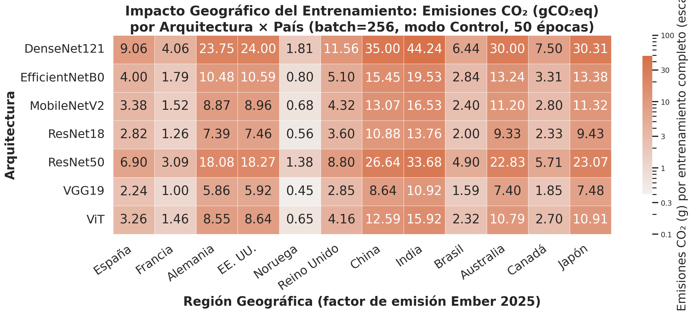

# Carbon Emissions Modeling

Training deep learning models has a geographical environmental impact. The carbon footprint of an experiment is determined not only by how much energy is consumed, but also by **where** that energy is drawn from.

`monitor_app` calculates CO₂ equivalent emissions in real-time by integrating local energy readings with global electricity grid carbon intensity factors.

## The Carbon Formula

The carbon emissions $C$ (in grams of $\text{CO}_2\text{eq}$) are computed as:

$$
C = E_{\text{total}} \text{ (kWh)} \times I_{\text{grid}} \text{ (gCO}_2\text{/kWh)}
$$

Where:
- $E_{\text{total}}$ is the total active energy consumed by CPU and GPU, converted to kilowatt-hours (1 kWh = $3.6 \times 10^6$ Joules).
- $I_{\text{grid}}$ is the carbon intensity factor of the electricity grid in the target region.

## Geographic Sensitivity

The carbon intensity of electricity grid mixes varies by region, depending on the share of fossil fuels (coal, gas) vs low-carbon sources (nuclear, hydro, wind, solar).

`monitor_app` embeds the **Ember 2025 dataset** containing provisional country-level emission factors and legacy 2022 continent averages:

| Region | Grid Mix Characteristics | Intensity Factor (gCO₂/kWh) |
|--------|--------------------------|-----------------------------|
| **Norway** | Predominantly Hydroelectric | ~11 |
| **France** | Predominantly Nuclear | ~56 |
| **Spain** | Renewable + Gas | ~181 |
| **USA** | Coal + Gas + Nuclear | ~367 |
| **India** | Coal-dominant | ~725 |

### The Geographic Multiplier

A core finding of the benchmark is that **geography is the single most impactful variable** on carbon emissions. Because the intensity factor is a direct multiplier, running the exact same model training in India generates **31.5× more CO₂** than running it in Norway, and **10.0× more CO₂** than running it in France!

_Emissions heatmap across architectures and geographic locations (logarithmic scale)._

As shown in the heatmap, the relative emission ratio between countries remains constant across all architectures. While technical optimizations (like Energy Early Stopping) save energy, migrating your compute load to a clean grid (such as France or Norway) yields a carbon reduction that is one to two orders of magnitude higher.

---
**Next:** Read about the [Intensity Factor](intensity-factor.md).
