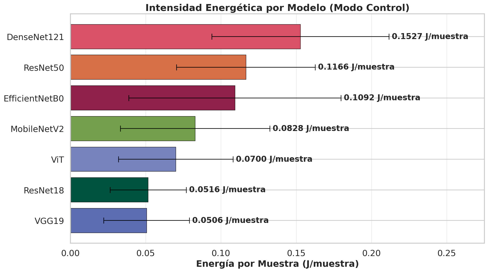

# Intensity Factor (J/sample)

When measuring energy efficiency in machine learning, comparing total energy (in Joules or Wh) across different runs is often misleading if the runs processed a different number of training samples or ran for a different number of epochs.

To resolve this, `moniaenergy` defines the **Intensity Factor** as the average energy consumed per processed sample, measured in **Joules per sample (J/sample)**:

$$
\text{Intensity Factor} = \frac{\text{Total Energy (J)}}{\text{Total Samples Processed}}
$$

This metric serves as a normalized, standard efficiency indicator that is independent of batch size or epoch length, enabling direct comparison between different architectures and configurations.

## Benchmark Results

Our benchmark evaluated the average energy intensity of six classic computer vision architectures trained on CIFAR-10 in Control mode (without active optimization):

_Energy intensity (J/sample) across the six benchmarked models, averaged over all batch sizes._

### Analysis of Architectures

1. **VGG19 (0.0486 J/sample)**: 
   Despite having the highest parameter count (144M), VGG19 is the most efficient model per sample in this benchmark. Because VGG19's network structure consists of simple, standard dense 3x3 convolutions with low memory access overhead, it compiles into highly optimized GPU kernels that maximize SM utilization and finish training rapidly.
2. **MobileNetV2 (0.0806 J/sample)**:
   MobileNetV2 is highly efficient at low batch sizes (32–128), but suffers a significant efficiency drop at batch size 256 where memory bandwidth saturation occurs, bringing its average intensity down.
3. **ResNet18 (0.1051 J/sample) & ResNet50 (0.1112 J/sample)**:
   ResNet architectures display balanced intensity, scaling extremely well with larger batch sizes as they transition into the compute-bound regime.
4. **DenseNet121 (0.2125 J/sample)**:
   DenseNet121 has the highest energy intensity, requiring **4.4× more energy per sample** than VGG19. This is due to its dense concatenation connections, which require extensive memory copies and create severe memory bandwidth bottlenecks.

## Optimization Use Cases

By monitoring the Intensity Factor, you can:
- **Compare Architectures**: Choose the model that yields the highest accuracy with the lowest J/sample.
- **Tune Hyperparameters**: Select the batch size and optimizer that minimize J/sample on your hardware.
- **Profile Deployments**: Measure the energy cost per inference request.

---
**Next:** Learn about [Energy Grading](energy-grading.md) thresholds.
