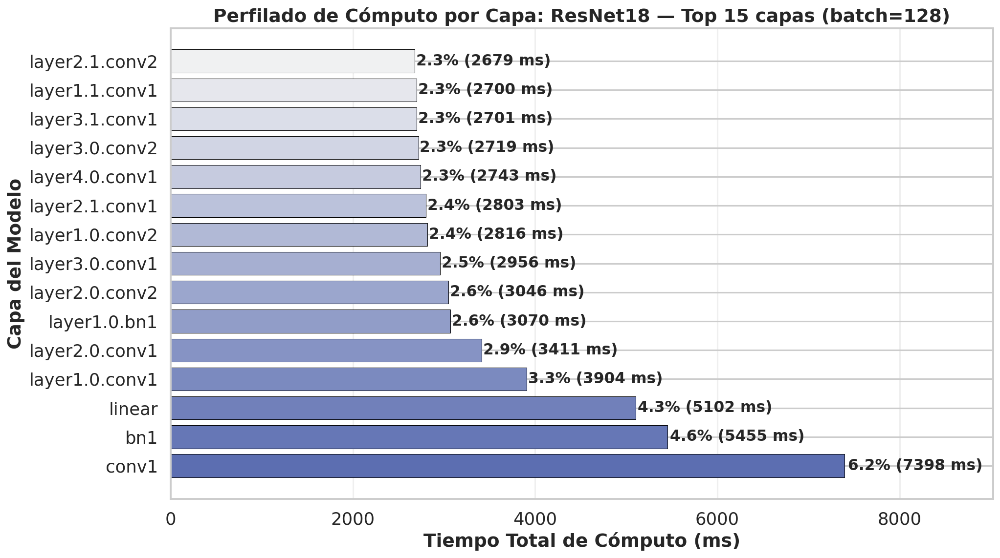

# Advanced Monitoring: Layer-by-Layer Profiling

For deep architectural optimization, knowing the total energy consumption of a model is not enough. You need to know which layers are the energy "hotspots."

`moniaenergy` includes the **`LayerEnergyProfiler`**, which registers PyTorch forward and backward hooks to attribute CPU and GPU power consumption to individual layers.

## Registering the Profiler

To profile individual layers, instantiate the `LayerEnergyProfiler` and wrap your training step:

```python
from monIAenergy.monitor.pytorch_hooks import LayerEnergyProfiler
import torch

model = MyModel()
profiler = LayerEnergyProfiler(model)

# Start profiling
profiler.start()

# Run a training step
inputs = torch.randn(32, 3, 224, 224).cuda()
outputs = model(inputs)
loss = outputs.sum()
loss.backward()

# Stop profiling and print report
profiler.stop()
summary = profiler.get_summary()
print(summary)
```

## Reading the Layer Profile Report

The profiler outputs a breakdown of each layer's parameter count, forward/backward time (ms), total energy (J), and relative share of model energy.

For example, when profiling ResNet18:


_Computational and energy profile per layer in ResNet18._

### Key findings from the benchmark

Our layer profiling experiments revealed:
1. **Convolutional Concentration**: Over 60% of the energy consumption in standard CNN architectures (like ResNet18) is concentrated in the dense 3x3 convolutional layers.
2. **Backward Pass Cost**: The backward pass (gradient calculation and weight update) consistently consumes **1.8× to 2.2×** more energy than the forward pass.
3. **Pooling and Activation Overhead**: Pooling and activation layers (ReLU, MaxPool) consume negligible active energy (<2%) but introduce latency, which increases background/leakage energy draw.

## Advisor Suggestions

The `OptimizerAdvisor` uses the layer profiling metrics to recommend architectural changes:
- **High memory overhead / low SM utilization**: Recommends reducing batch size or using mixed precision (FP16).
- **Linear/Fully Connected bottleneck**: Recommends applying weight pruning or factorization.

---
**Next:** Learn about [Energy Early Stopping](energy-early-stopping.md) to automatically save energy during training.
