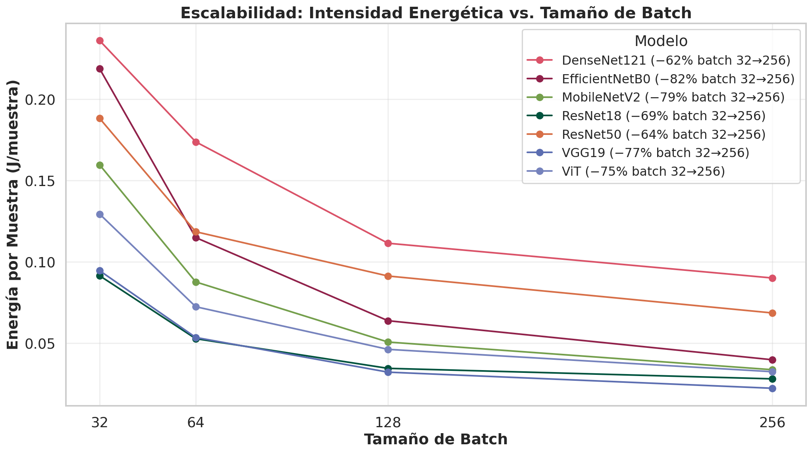

# Basic Usage Guide

This guide describes how to configure `moniaenergy` for standard runs and discusses the impact of hyperparameter choices (such as batch size) on energy efficiency.

## Integrating monitor_train

The standard entry point to instrument your PyTorch training loop is `monitor_train`. The context manager configures hardware monitors, enables tracking hooks, and logs statistics automatically.

```python
from monIAenergy import monitor_train
import torch

# Define model, optimizer, loss function, and dataloader
model = MyModel()
optimizer = torch.optim.Adam(model.parameters())
loss_fn = torch.nn.CrossEntropyLoss()

with monitor_train(
    model=model,
    experiment_name="my_model_experiment",
    country="Spain",
    batch_size=128,
) as mon:
    for epoch in range(epochs):
        mon.epoch_start(epoch)
        
        # Training logic
        for inputs, targets in train_loader:
            optimizer.zero_grad()
            outputs = model(inputs)
            loss = loss_fn(outputs, targets)
            loss.backward()
            optimizer.step()
            
        # Register metrics at the end of the epoch
        mon.epoch_end(
            epoch=epoch,
            samples=len(train_loader.dataset),
            loss=loss.item(),
            accuracy=compute_accuracy(model, train_loader)
        )
```

## Batch Size and Energy Intensity

A critical finding of the benchmark is that **batch size has a non-linear impact on energy efficiency**. 

Traditionally, researchers believe that a larger batch size always increases efficiency because it improves GPU utility. However, this holds true only up to a point, known as the **arithmetic intensity threshold**.

### The MobileNetV2 Batch Size Inversion

In our controlled benchmark sweep, we discovered that **MobileNetV2** is highly energy-efficient at small batch sizes (32 to 128), consuming up to 31% less energy than **ResNet18**. However, at **batch size 256**, the relationship is **inverted**: MobileNetV2 consumes **37% more energy per sample** than ResNet18!


_Batch size sweep showing energy intensity (J/sample) across different models._

### Technical Explanation (Roofline Model)

According to the Roofline model:
- **MobileNetV2** uses *depthwise separable convolutions* which reduce the total FLOP count. This is highly beneficial at batch sizes 32–128.
- At **batch size 256**, the large size of intermediate activation tensors desynchronizes with the GPU L2 cache, forcing frequent data retrieval from the global GDDR6 memory.
- Since depthwise convolutions apply a single weight per channel, their *arithmetic intensity* (FLOPs/byte) is extremely low. Thus, at large batch sizes, MobileNetV2 becomes **memory-bound**. The GPU cores spend energy waiting for data, increasing overall energy consumption per sample.
- **ResNet18** uses standard dense 3x3 convolutions, which have higher arithmetic intensity. At batch size 256, it reaches its optimal compute-bound regime, maximizing Streaming Multiprocessor (SM) utilization and achieving superior efficiency.

### Recommendation
If you are using depthwise separable architectures like MobileNetV2 or EfficientNet, avoid large batch sizes (such as 256) on high-end desktop/workstation GPUs (such as RTX Ada) to prevent memory bandwidth starvation and high energy waste.

---
**Next:** Read the [Advanced Monitoring Guide](advanced.md) to learn how to profile individual layers.
