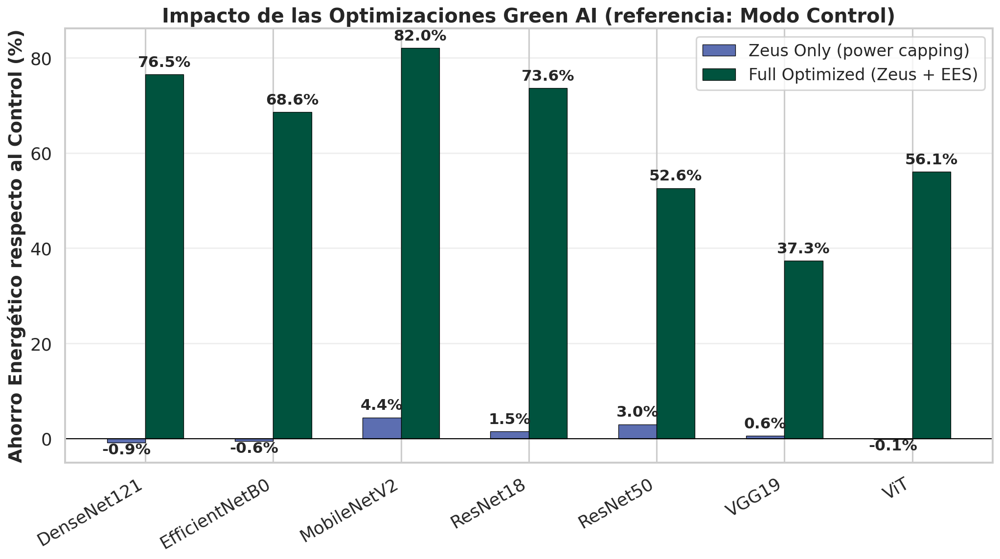

# GPU Power Optimization (Zeus-Style)

NVIDIA GPUs are designed to boost clock frequencies as high as thermal and power envelopes permit. However, due to the non-linear relationship between clock frequency and power consumption, the highest power limit is rarely the most energy-efficient.

Inspired by the [Zeus framework](https://ml.energy/zeus), `monitor_app` includes the **`GpuPowerOptimizer`**, which dynamically adjusts the GPU power limit (capping) to find the optimal trade-off on the energy-accuracy Pareto frontier.

## Operating Modes

1. **ACTIVE Mode (requires `sudo` / root privileges)**:
   The framework directly communicates with the hardware using NVIDIA's NVML library (`nvmlDeviceSetPowerManagementLimit`). It caps the maximum power draw at the start of each epoch and restores the original threshold upon termination.
2. **ADVISOR-ONLY Mode (no root privileges)**:
   If `monitor_app` is executed without root privileges, it **does not crash**. Instead, it simulates the optimization sweeps, constructs the Pareto frontier, and prints recommendations to the terminal so that you can manually configure the power limit or request administrator intervention.

## Configuration

To enable GPU power optimization:

```python
with monitor_train(
    model=model,
    experiment_name="gpu_opt_run",
    power_optimize=True,     # Activate GpuPowerOptimizer
    gpu_index=0,             # GPU index to control
    time_budget_pct=0.10,    # Allow up to 10% training slowdown to save energy
) as mon:
    # Training loop...
```

## The Pareto Exploration Protocol

At the start of training:
1. **Exploration Phase**: During the first 5 epochs, the optimizer sweeps across five candidate power limits (e.g., 180W, 210W, 240W, 270W, 300W).
2. **Evaluation Phase**: It compiles energy intensity (J/sample) and epoch duration (seconds) for each configuration.
3. **Explotation Phase**: It selects the lowest power limit that does not slow down epoch duration beyond `time_budget_pct` relative to the baseline (300W).


_Comparison of energy consumption variations across optimization modes relative to the Control baseline._

## Empirical Findings and Limitations

Our benchmark results highlighted:
- **Heterogeneous Savings**: Active power capping is highly architecture and batch-size dependent. In compute-heavy regimes (such as DenseNet121 with batch size 128), capping power at 240W achieved **44.66% energy savings**.
- **Counter-productive limits**: If the limit is set too low (e.g., 180W), clock frequencies drop so low that epoch duration spikes. This causes the GPU to run longer, consuming more background energy and actually *increasing* total energy (e.g., DenseNet121 with batch size 64 increased consumption by 102.20%).
- **Roofline Boundary**: Power limiting is highly effective for compute-bound operations, but offers no benefit (and can be detrimental) to memory-bound operations.

---
**Next:** Learn about the [Energy Grading System](../concepts/energy-grading.md).
