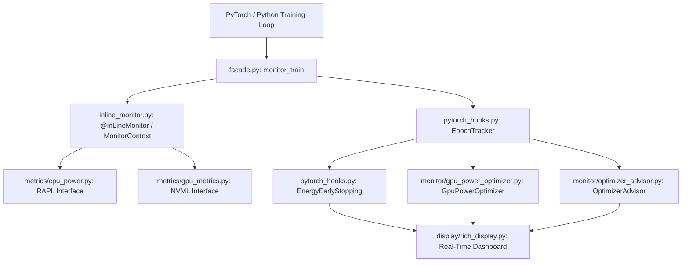

# User Guide Overview

Welcome to the detailed user guide for **monIAenergy**! This guide is designed to help you understand how to integrate, configure, and get the most out of the framework to measure and optimize the energy consumption of your machine learning models.

## Framework Architecture

The framework is structured into modular layers that separate hardware interaction, metrics accumulation, active advice, and visualization:

## Key Modules

`moniaenergy` includes the following core modules:

1. **Hardware Telemetry (`moniaenergy.metrics`)**: Direct interface with Intel RAPL (CPU) and NVIDIA NVML (GPU) to read instantaneous power (W) and accumulated energy (J) without estimation.
2. **PyTorch Callbacks (`moniaenergy.monitor.pytorch_hooks`)**: Tracks training/validation epochs and logs metadata automatically.
3. **Green AI Grading (`moniaenergy.metrics.green_grader`)**: Universal grading system (A++ to F) that normalizes efficiency relative to historic benchmarks.
4. **Optimization Advisor (`moniaenergy.monitor.optimizer_advisor`)**: Analyzes hardware bottlenecks (such as high memory-bound states) and outputs recommended configurations.
5. **GPU Power Optimizer (`moniaenergy.monitor.gpu_power_optimizer`)**: Dynamic JIT power limiter that explores the Pareto frontier.
6. **Energy Early Stopping (`moniaenergy.monitor.pytorch_hooks.EnergyEarlyStopping`)**: Halts training if the ratio of accuracy improvement to energy consumption drops below the threshold.

## Workflow

To run a basic optimization/monitoring pipeline:

1. **Setup permissions**: Grant read access to Intel RAPL for CPU telemetry.
2. **Wrap your loop**: Place your training loop inside the `monitor_train` context manager.
3. **Register epochs**: Call `mon.epoch_start(epoch)` and `mon.epoch_end(epoch, ...)` to demarcate epochs.
4. **Analyze outputs**: Review terminal dashboard in real-time, inspect saved NDJSON and CSV logs, and view generated comparative figures.

---
**Next:** Read the [Basic Usage Guide](basic-usage.md) to integrate the framework into your PyTorch training loop.
